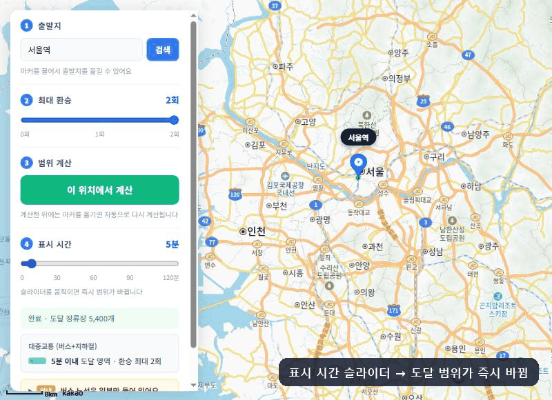
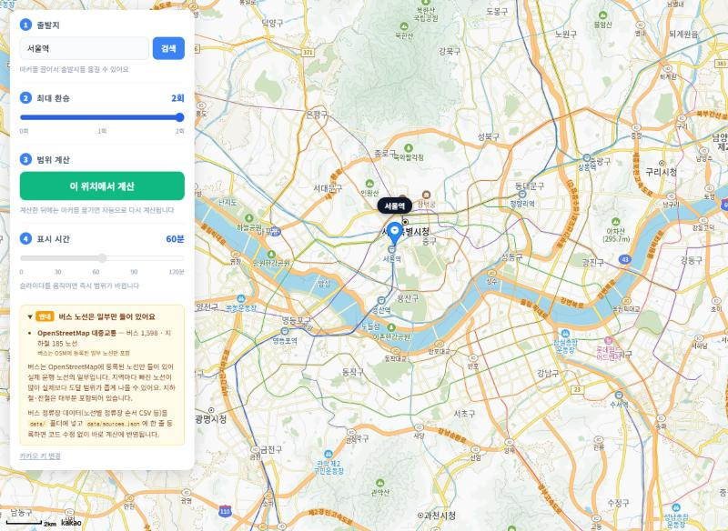
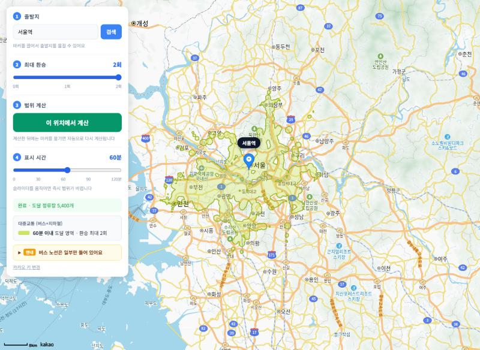
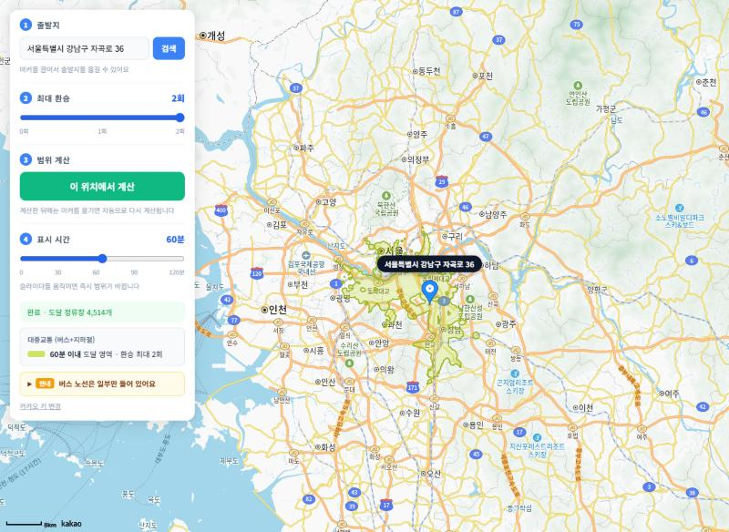
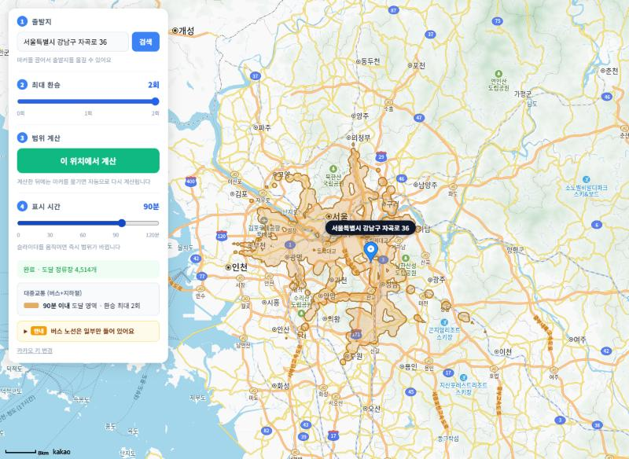
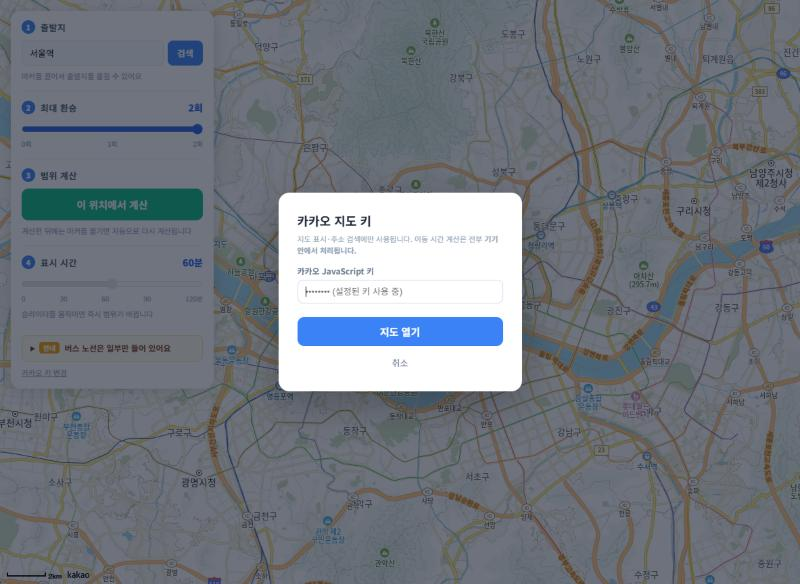

<div align="center">

# 🚇 대중교통 이동 범위 지도

**버스·지하철로 _n분 안에_ 갈 수 있는 곳을 지도에 그려주는 등시간선(Isochrone) 지도**

외부 경로 API 호출 0회 · 브라우저에서 직접 계산 · 빌드 도구 없는 Vanilla JS

<br />

<a href="https://korea-isochrone-map.vercel.app"></a>

[](https://github.com/helloGoni/korea-isochrone-map/actions/workflows/deploy.yml)
[](https://github.com/helloGoni/korea-isochrone-map/commits/main)
[](LICENSE)


<br />



</div>

<br />

**핵심: 이동 시간 계산에 외부 경로 API를 전혀 호출하지 않습니다.** 대중교통 노선 데이터를 파일로 한 번 받아 라우팅 그래프로 만들어 두고, 브라우저에서 **직접 RAPTOR(라운드 기반 최단 경로)** 로 계산합니다. 그래서 API 호출 제한·요금·키 발급이 없고, 한 번 그래프를 만들면 인터넷 없이도 동작합니다.

> 카카오 JavaScript 키는 **지도 표시와 주소 검색**에만 쓰입니다 (지도 SDK 내장 기능, 호출 제한 없음).

> [!IMPORTANT]
> **버스 데이터는 일부만 들어 있습니다.** 현재 버스 노선은 OpenStreetMap(OSM)에 등록된 것만 포함되어 실제 운행 노선의 일부입니다(지역마다 빠진 노선이 많음). 그래서 버스로 갈 수 있는 범위가 **실제보다 좁게** 나올 수 있습니다. 지하철·전철은 대부분 포함되어 있습니다.
>
> 대신 **버스 정류장 데이터(노선별 정류장 순서 CSV 등)를 `data/`에 넣고 `data/sources.json`에 한 줄 등록하면, 코드 수정 없이 바로 계산에 반영**됩니다. → [데이터 추가하기](#데이터-추가하기)

## 특징

- 🗺️ **등시간선 시각화** — 시간이 짧으면 초록, 길수록 빨강 그라데이션
- 🎚️ **실시간 슬라이더** — 0~n분을 끌면 즉시 영역이 바뀜 (계산은 1회, 등고선만 재추출)
- 🔁 **환승 제한** — 최대 환승 0~2회를 슬라이더로 지정 (RAPTOR로 정확히 계산)
- 🧭 **정밀한 경계** — 시간장 + 마칭 스퀘어로 오목·분리 구역·홀까지 표현
- 📍 **드래그로 출발지 이동** — 서울역에 놓인 마커를 끌어서 옮기면 자동 재계산 (주소 검색도 가능)
- 🧩 **데이터 꽂으면 끝** — 버스/지하철 CSV·JSON을 등록만 하면 기존 데이터와 합쳐져 바로 반영
- 🔌 **외부 경로 API 0회** — 완전 로컬 계산, 빌드 도구 없음(Vanilla JS)
- 🔒 **키 비노출** — 설정된 카카오 키는 입력란에 표시되지 않음

---

## 목차

1. [스크린샷](#스크린샷)
2. [빠른 시작](#빠른-시작)
3. [사용 방법](#사용-방법)
4. [현재 데이터 범위](#현재-데이터-범위)
5. [데이터 추가하기](#데이터-추가하기) ← 버스 정류장 넣기
6. [로컬 엔진은 어떻게 동작하는가](#로컬-엔진은-어떻게-동작하는가)
7. [OSM 그래프 다시 빌드하기](#osm-그래프-다시-빌드하기)
8. [프로젝트 구조](#프로젝트-구조)
9. [한계](#한계)
10. [기여 & 라이선스](#기여--라이선스)

---

## 스크린샷

| 처음 화면 — 마커는 서울역, 데이터 안내 | 계산 결과 — 60분 이내 도달 영역 |
|:---:|:---:|
|  |  |
| **마커 드래그 — 옮기면 자동 재계산, 주소 표시** | **표시 시간 슬라이더 — 90분으로 즉시 변경** |
|  |  |
| **키 변경 화면 — 설정된 키는 보이지 않음** | |
|  | |

---

## 빠른 시작

### 1. 카카오 JS 키 설정

```bash
cp src/config.example.js src/config.js
```

`src/config.js` 에 카카오 JavaScript 키를 입력합니다. ([developers.kakao.com](https://developers.kakao.com) → 앱 추가 → JavaScript 키)

```js
export const KAKAO_JS_KEY = '여기에_입력';
```

- 키를 넣어 두면 **키 입력 화면 없이 바로 지도가 열리고**, 키는 화면 어디에도 표시되지 않습니다.
- `config.js` 를 만들지 않으면 첫 화면에서 키를 입력합니다(입력란은 `●●●` 로 가려지고, 이 브라우저에만 저장).
- `src/config.js` 는 `.gitignore` 에 포함되어 커밋되지 않습니다.

카카오 개발자 콘솔 → **플랫폼 → Web** 에 접속 주소(포트 포함, 예: `http://127.0.0.1:5500`)를 등록해야 지도가 뜹니다.

> [!NOTE]
> 카카오 **JavaScript 키는 원래 브라우저로 전달되는 공개용 키**라서, 개발자 도구의 네트워크 탭에서는 볼 수 있습니다(지도 SDK 주소에 포함). 이 앱은 화면에 노출되지 않게만 하고, **실제 보호는 카카오 콘솔의 "플랫폼 → Web" 도메인 등록**이 담당합니다. 등록된 도메인이 아니면 키를 가져가도 지도가 뜨지 않습니다.

### 2. 로컬 서버로 실행

```bash
npx serve -l 5500 .
```

`http://127.0.0.1:5500` 으로 접속합니다.

> 대중교통 그래프(`data/transit-graph.json`)는 저장소에 포함되어 있어 **빌드 없이 바로 실행**됩니다.
> `file://` 로 열면 ES Module이 동작하지 않으니 반드시 HTTP 서버로 여세요.

### 3. 배포 (GitHub Pages / Vercel)

`main` 에 푸시하면 `.github/workflows/deploy.yml` 이 `scripts/assemble-site.js` 로 `public/` 을 만들어 배포합니다. 키는 저장소 Secrets 의 `KAKAO_JS_KEY` 로 주입되므로 코드에 남지 않습니다.

---

## 사용 방법

1. **출발지** — 지도를 열면 마커가 **서울역**에 있습니다. **마커를 끌어서** 원하는 곳에 놓거나, 주소·장소를 검색하세요. (지도를 클릭해도 마커가 움직이지 않으므로, 지도를 둘러보다 출발지가 바뀌는 일이 없습니다.)
2. **최대 환승** — 0~2회 슬라이더. 값을 바꾸면 경로를 다시 탐색합니다 (환승이 적을수록 도달 범위가 좁아짐)
3. **이 위치에서 계산** — RAPTOR 경로 탐색 1회 + 시간장 1회 구축. **한 번 계산한 뒤에는 마커를 옮길 때마다 자동으로 다시 계산**합니다.
4. **표시 시간 슬라이더(0~최댓값)** — 움직이는 즉시 폴리곤이 바뀝니다

표시 시간 슬라이더가 빠른 이유: **시간장 계산은 한 번만** 하고, 슬라이더는 그 결과에서 등고선만 다시 뽑기 때문입니다. 색은 시간이 짧으면 초록, 길수록 빨강으로 변합니다.

### 설정 (`src/config.js`)

UI에 옵션을 두지 않고 **숫자로** 조절합니다.

```js
export const MAX_MINUTES = 120;  // 슬라이더 최댓값(분)
export const GRID_CELL_M = 100;  // 격자 한 칸(m). 작을수록 정밀(권장 80~250)
export const DEFAULT_ORIGIN = { lat: 37.5559, lng: 126.9723, name: '서울역' }; // 처음 마커 위치
```

---

## 현재 데이터 범위

화면 왼쪽 아래 **「안내」** 를 펼치면 지금 불러온 데이터와 수단별 노선 수가 표시됩니다.

| 데이터 | 내용 | 비고 |
|---|---|---|
| OpenStreetMap 대중교통 (`data/transit-graph.json`) | 정류장 15,660개 · **지하철 185 · 버스 1,598 노선** (방향별) | 2026-06 Geofabrik 추출본 |

- **지하철·전철**: 수도권을 중심으로 대부분 포함되어 있습니다.
- **버스**: OSM 자원봉사자가 등록한 노선만 들어 있습니다. 실제 운행 노선의 일부이며 지역마다 빠진 노선이 많습니다(예: 서울 시내버스도 일부만 등록). → 버스 도달 범위는 **실제보다 좁게** 나올 수 있습니다.
- 공공데이터포털·지자체의 버스 노선/정류장 데이터를 추가하면 이 부분을 바로 보완할 수 있습니다. ↓

---

## 데이터 추가하기

`data/sources.json` 이 "어떤 데이터를 불러올지" 목록입니다. **파일을 `data/` 에 넣고 여기에 한 항목 추가하면 끝**입니다. 여러 소스는 하나의 네트워크로 합쳐지고, 서로 350m 이내의 정류장은 도보 환승으로 자동 연결되므로 새 버스 노선이 기존 지하철과 바로 이어집니다.

```json
{
  "sources": [
    { "id": "osm", "type": "graph-json", "url": "transit-graph.json", "label": "OpenStreetMap 대중교통" },

    { "id": "seoul-bus", "type": "routes-csv", "url": "seoul-bus-stops.csv",
      "label": "서울 시내버스", "mode": "bus", "encoding": "euc-kr" }
  ]
}
```

| 항목 | 설명 |
|---|---|
| `type` | 데이터 형식 — `routes-csv` / `routes-json` / `graph-json` (아래 참고) |
| `url` | `data/sources.json` 기준 상대 경로 |
| `label` | 화면 「안내」에 표시될 이름 |
| `mode` | 기본 수단 — `bus`, `subway`, `light_rail`, `train` … (속도 추정에 사용) |
| `note` | 화면에 함께 표시할 한 줄 설명 (선택) |
| `encoding` | 파일 인코딩. 공공데이터 CSV는 대개 `euc-kr` (기본 `utf-8`) |
| `columns` | CSV 열 이름이 자동 인식되지 않을 때 직접 지정 (선택) |
| `enabled` | `false` 면 불러오지 않음 |

### ① `routes-csv` — 노선별 정류장 순서 CSV (공공데이터 형식, 추천)

한 행 = (노선, 순번, 정류장). 공공데이터포털의 「버스노선별 정류소 정보」류 파일을 그대로 쓸 수 있습니다.

```csv
노선명,순번,정류소ID,정류소명,X좌표,Y좌표
472,1,101000001,서울역,126.9723,37.5559
472,2,101000002,숭례문,126.9752,37.5610
```

- 열 이름은 흔히 쓰는 이름을 **자동 인식**합니다: `노선ID`/`노선명`/`ROUTE_NM`, `순번`/`STATION_ORDER`, `정류소ID`/`NODE_ID`, `정류소명`, `X좌표`·`Y좌표`/`GPS_X`·`GPS_Y`/`lng`·`lat` 등.
  다르면 `"columns": { "route": "ROUTE_NM", "seq": "ORD", "lat": "Y", "lng": "X" }` 처럼 지정하세요.
- 좌표는 **WGS84 위경도(도 단위)** 여야 합니다. (TM 좌표는 변환 필요 — 범위를 벗어난 행은 자동으로 건너뜀)
- 정류소ID가 같으면 노선이 달라도 같은 정류장으로 합쳐져 환승이 됩니다.
- 구간 시간은 정류장 간 거리 ÷ 수단 평균 속도로 추정합니다(버스 20km/h, 지하철 35km/h).
- 예시: [`data/examples/bus-routes.sample.csv`](data/examples/bus-routes.sample.csv) (`sources.json` 에 `"enabled": false` 로 등록되어 있음)

### ② `routes-json` — 직접 작성하기 쉬운 JSON

```json
{ "routes": [
  { "name": "472", "mode": "bus",
    "stops": [
      { "id": "101000001", "name": "서울역", "lat": 37.5559, "lng": 126.9723 },
      { "id": "101000002", "name": "숭례문", "lat": 37.5610, "lng": 126.9752 }
    ],
    "times": [120] }
] }
```

`times`(구간별 초)는 선택입니다. 없으면 수단 속도로 추정합니다.

### ③ `graph-json` — `npm run build:transit` 이 만드는 압축 그래프

다른 지역 OSM 추출본으로 그래프를 하나 더 만들어 함께 등록할 수도 있습니다.

### 새 형식 지원하기 (GTFS 등)

`TransitSource` 를 상속해 `load(network)` 에서 `network.addStop()` / `network.addRoute()` 만 호출하면 됩니다.

```js
// src/sources/MyFormatSource.js
import { TransitSource, StopRegistry } from './TransitSource.js';

export class MyFormatSource extends TransitSource {
  async load(network) {
    const data  = await this.fetchJson();          // 또는 this.fetchText()
    const stops = new StopRegistry(network);       // 같은 정류장 중복 방지
    for (const r of data.lines) {
      network.addRoute({
        stops:  r.stations.map(s => stops.resolve({ id: s.code, name: s.name, lat: s.y, lng: s.x })),
        mode:   r.kind ?? this.defaultMode,
        name:   r.number,
        source: this.id,
      });
    }
  }
}
```

그리고 `src/sources/index.js` 의 `SOURCE_TYPES` 에 `'my-format': MyFormatSource` 를 등록하면 `sources.json` 에서 `"type": "my-format"` 으로 쓸 수 있습니다. 라우팅·시간장·화면 안내는 자동으로 따라옵니다.

---

## 로컬 엔진은 어떻게 동작하는가

외부 경로 API가 하던 일("A에서 B까지 몇 분?")을 우리가 직접 합니다. 4단계예요.

### 1단계 — 노선 데이터를 네트워크로 (`src/sources/*` → `TransitNetwork`)

OpenStreetMap에는 버스·지하철 **노선(relation)** 이 "정류장들의 순서"로 들어 있습니다. 환승 횟수를 셀 수 있도록 **노선의 정류장 순서를 그대로 보존**합니다. CSV/JSON으로 추가한 노선도 같은 형태로 합쳐집니다.

- **정류장** = 노드 (좌표 보유)
- **노선** = 정류장의 순서 배열 + 구간별 **이동 시간(초)** + 수단(`bus`/`subway`)
  - 두 정류장의 직선 거리 ÷ 평균 속도로 추정 (지하철 35km/h, 버스 20km/h)
- **도보 환승** = 서로 350m 이내인 정류장끼리 (도보 80m/분) — 로드 시 런타임에서 계산

```
  2호선:    … 강남 ─2분─ 역삼 ─2분─ 선릉 …
  신분당선: … 강남 ─3분─ 양재 …          ← 강남에서 갈아타면 환승 1회
```

### 2단계 — 최대 k회 환승, 최소 시간 찾기 (`RaptorRouter`)

단순 다익스트라는 "몇 번 갈아탔는지"를 모릅니다. 그래서 대중교통 전용 알고리즘 **RAPTOR(라운드 기반)** 를 씁니다.

- **라운드 r = 탑승 r회로 도달** ⇒ 환승 횟수 = 탑승 − 1. 따라서 **라운드를 (최대 환승 + 1)번만** 돌리면 "최대 k회 환승" 제한이 정확히 걸립니다.
- 각 라운드는 정류장이 아니라 **노선 단위로 스캔**합니다: 이전 라운드에 도달한 정류장에서 그 노선을 타고 끝까지 가며 하차 시각을 갱신.
- 라운드 사이에 **도보 환승**(350m)을 적용 — 걷는 건 탑승이 아니라 라운드를 소모하지 않습니다.

```
시드(도보권 정류장, 탑승 0회)
  └ 라운드1: 한 번 타기      → 환승 0회로 갈 수 있는 곳
     └ 라운드2: 갈아타기      → 환승 1회
        └ 라운드3: 또 갈아타기 → 환승 2회
```

### 3단계 — "시간장(time field)" 격자 만들기 (`TimeField.build`)

지역을 **격자(grid)** 로 덮고, **각 칸까지의 최소 도달 시간**을 기록합니다.

각 칸의 시간 = 다음 중 최솟값:
- 출발지에서 그 칸까지 **직접 도보**한 시간
- (2단계에서 구한) **각 정류장 도달 시간 + 정류장→칸 도보 시간** (하차 후 도보는 최대 1km로 제한)

```
  칸 시간(분):
   12 10  9  9 11 14      숫자가 작을수록 빨리 닿는 곳.
   10  7  6  6  8 12      정류장 주변은 작고, 노선을 따라
    9  6  ⊙  5  7 10      먼 곳까지 낮은 값이 이어진다.
   11  8  6  7  9 13      (⊙ = 출발지)
```

시간장은 출발지당 **한 번만** 만듭니다.

### 4단계 — 슬라이더로 등고선(폴리곤) 즉시 그리기 (`TimeField#contour`)

"N분 이내"는 곧 **시간장에서 값이 N분 이하인 칸들의 경계선**입니다. 등고선을 따는 표준 알고리즘 **마칭 스퀘어(marching squares)** 로 그 경계를 폴리곤으로 추출합니다. 오목한 모양, 노선을 따라 뻗는 촉수 모양, 멀리 떨어진 분리 구역까지 표현되고, 슬라이더를 옮기면 **시간장은 그대로 두고 등고선만 다시** 땁니다 (수십 ms).

---

## OSM 그래프 다시 빌드하기

> 그래프(`data/transit-graph.json`)는 저장소에 **이미 포함**되어 있습니다. 아래는 OSM 데이터를 **갱신하거나 다른 지역으로 바꿀 때만** 필요합니다.

```bash
npm install
```

```bash
npm run build:transit
```

1. `data/south-korea-latest.osm.pbf` 가 없으면 [Geofabrik](https://download.geofabrik.de/asia/south-korea.html)에서 자동 다운로드 (약 270MB, **이어받기 지원**)
2. PBF를 2-pass로 파싱 (노선 → 정류장 좌표)
3. `data/transit-graph.json` 생성 (노선별 수단·번호 포함)

직접 받은 다른 지역 PBF를 쓰려면 `node scripts/build-from-pbf.js path/to/region.osm.pbf`.

---

## 프로젝트 구조

```
korea-isochrone-map/
├── index.html
├── data/
│   ├── sources.json              # ★ 불러올 데이터 목록 — 여기에 등록하면 자동 반영
│   ├── transit-graph.json        # OSM 대중교통 그래프 (저장소에 포함)
│   └── examples/
│       └── bus-routes.sample.csv # 버스 CSV 형식 예시
├── scripts/
│   ├── build-from-pbf.js         # OSM PBF → transit-graph.json
│   └── assemble-site.js          # 배포용 public/ 생성
├── docs/
│   ├── demo.gif                  # README 상단 데모
│   ├── social-preview.png        # 링크 공유 미리보기 (1280×640)
│   └── screenshots/              # README 스크린샷
└── src/
    ├── main.js                   # 진입점: 설정 읽고 IsochroneApp 시작
    ├── config.example.js         # 설정 양식 (복사해서 config.js 로, git 제외)
    ├── style.css
    ├── app/
    │   └── IsochroneApp.js       # 화면 ↔ 엔진 연결 (출발지·계산·자동 재계산)
    ├── engine/                   # 지도/DOM과 무관한 순수 계산 (Node에서도 실행 가능)
    │   ├── IsochroneEngine.js    # 데이터 로드 + RAPTOR + 시간장 묶음
    │   ├── TransitNetwork.js     # 정류장·노선·도보환승 인덱스
    │   ├── RaptorRouter.js       # 최대 k회 환승 경로 탐색
    │   ├── TimeField.js          # 시간장 + 마칭 스퀘어 등고선
    │   └── geo.js                # 거리·속도 상수
    ├── sources/                  # 데이터 형식별 로더 (플러그인)
    │   ├── index.js              # SOURCE_TYPES 레지스트리 + sources.json 로더
    │   ├── TransitSource.js      # 기본 클래스 + StopRegistry
    │   ├── GraphJsonSource.js    # graph-json
    │   ├── RouteCsvSource.js     # routes-csv
    │   └── RouteJsonSource.js    # routes-json
    └── ui/
        ├── KakaoMapView.js       # 카카오 지도·드래그 마커·폴리곤·장소 검색
        ├── ControlPanel.js       # 사이드 패널 DOM
        ├── KeyGate.js            # 카카오 키 입력 화면 (키 비노출)
        └── colors.js
```

데이터 흐름:
```
data/sources.json ─┬ graph-json (OSM)  ─┐
                   ├ routes-csv (버스)  ─┼→ TransitNetwork ─→ RaptorRouter(환승≤k) ─→ TimeField ─→ contour(n분) ─→ 카카오 폴리곤
                   └ routes-json …     ─┘                                                 └ 슬라이더는 시간장만 재사용(즉시) ┘
```

---

## 한계

- **버스 데이터가 불완전합니다.** 기본 데이터의 버스 노선은 OSM 등록분뿐이라 실제보다 도달 범위가 좁게 나올 수 있습니다. → [데이터 추가하기](#데이터-추가하기)
- **이동 시간은 추정치입니다.** 실제 시간표(배차 간격·대기 시간)가 아니라 정류장 간 거리와 평균 속도로 계산합니다.
- 환승은 정류장 간 350m 이내 도보로 단순화했고, 환승 대기 시간은 반영하지 않습니다. 하차 후 도보는 최대 1km까지만 고려합니다.

---

## 기여 & 라이선스

기여 환영합니다. 버그·개선 아이디어는 이슈로, 코드는 PR로 보내주세요.

- 빌드 도구가 없으므로 정적 서버(`npx serve -l 5500 .`)로 바로 확인할 수 있습니다.
- 주석은 한국어로, 외부 라이브러리는 최소화해 주세요(런타임 의존성 0 유지).
- 알고리즘은 `src/engine/`, 데이터 형식은 `src/sources/`, 화면은 `src/ui/`에 있습니다.

데이터: [OpenStreetMap](https://www.openstreetmap.org/copyright) (ODbL), 추출본 제공 [Geofabrik](https://download.geofabrik.de/).
지도: [카카오맵](https://apis.map.kakao.com/).

코드 라이선스: [MIT](LICENSE).
