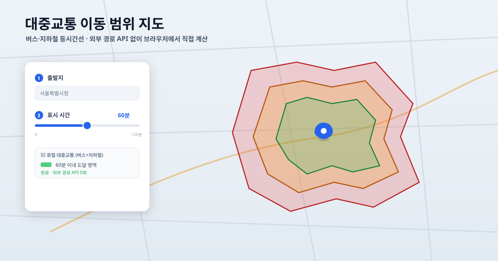

# 대중교통 이동 범위 지도 (Korea Transit Isochrone)

> 출발지에서 **버스·지하철로 n분 이내에 갈 수 있는 영역**을 지도에 색으로 표시하는 등시간선(Isochrone) 지도.


-success)


**핵심: 이동 시간 계산에 외부 경로 API를 전혀 호출하지 않습니다.** 대중교통 노선 데이터를 파일로 한 번 받아 라우팅 그래프로 만들어 두고, 브라우저에서 **직접 다익스트라(Dijkstra)** 로 계산합니다. 그래서 API 호출 제한·요금·키 발급이 없고, 한 번 그래프를 만들면 인터넷 없이도 동작합니다.

> 카카오 JavaScript 키는 **지도 표시와 주소 검색**에만 쓰입니다 (지도 SDK 내장 기능, 호출 제한 없음).



## 특징

- 🗺️ **등시간선 시각화** — 시간이 짧으면 초록, 길수록 빨강 그라데이션
- 🎚️ **실시간 슬라이더** — 0~n분을 끌면 즉시 영역이 바뀜 (계산은 1회, 등고선만 재추출)
- 🔁 **환승 제한** — 최대 환승 0~2회를 슬라이더로 지정 (RAPTOR로 정확히 계산)
- 🧭 **정밀한 경계** — 시간장 + 마칭 스퀘어로 오목·분리 구역·홀까지 표현
- 📍 **유연한 출발지** — 주소 검색 / 지도 클릭 / 마커 드래그
- 🔌 **외부 경로 API 0회** — 완전 로컬 다익스트라, 빌드 도구 없음(Vanilla JS)
- ⚙️ **숫자로 설정** — 표시 시간·정밀도를 `config.js`에서 조절

---

## 목차

1. [빠른 시작](#빠른-시작)
2. [사용 방법](#사용-방법)
3. [로컬 엔진은 어떻게 동작하는가](#로컬-엔진은-어떻게-동작하는가) ← 핵심 설명
4. [대중교통 데이터 빌드](#대중교통-데이터-빌드)
5. [프로젝트 구조](#프로젝트-구조)
6. [한계](#한계)
7. [기여 & 라이선스](#기여--라이선스)

---

## 빠른 시작

### 1. 카카오 JS 키 설정

```bash
cp src/config.example.js src/config.js
```

`src/config.js` 에 카카오 JavaScript 키를 입력합니다. ([developers.kakao.com](https://developers.kakao.com) → 앱 추가 → JavaScript 키)

```js
export const KAKAO_JS_KEY = '여기에_입력';
```

카카오 개발자 콘솔 → **플랫폼 → Web** 에 접속 주소(포트 포함, 예: `http://127.0.0.1:5500`)를 등록해야 지도가 뜹니다.

### 2. 로컬 서버로 실행

```bash
npx serve -l 5500 .
# http://127.0.0.1:5500 접속
```

> 대중교통 그래프(`data/transit-graph.json`)는 저장소에 포함되어 있어 **빌드 없이 바로 실행**됩니다.
> 데이터를 갱신하거나 다른 지역으로 바꾸려면 [대중교통 데이터 빌드](#대중교통-데이터-빌드)를 참고하세요.
>
> `file://` 로 열면 ES Module이 동작하지 않으니 반드시 HTTP 서버로 여세요.

---

## 사용 방법

1. **출발지** — 주소를 검색하거나, 지도를 클릭하거나, **마커를 드래그**해서 지정 (마커를 옮기면 자동으로 다시 계산됩니다)
2. **최대 환승** — 0~2회 슬라이더. 값을 바꾸면 경로를 다시 탐색합니다 (환승이 적을수록 도달 범위가 좁아짐)
3. **범위 계산** — 버튼을 누르면 RAPTOR 경로 탐색 1회 + 시간장 1회 구축
4. **표시 시간 슬라이더(0~최댓값)** — 움직이는 즉시 폴리곤이 바뀝니다

표시 시간 슬라이더가 빠른 이유: **시간장 계산은 한 번만** 하고, 슬라이더는 그 결과에서 등고선만 다시 뽑기 때문입니다. (최대 환승을 바꿀 때만 경로 탐색을 다시 합니다.) 색은 시간이 짧으면 초록, 길수록 빨강으로 변합니다.

### 표시 시간·정밀도 조절 (`src/config.js`)

UI에 옵션을 두지 않고 **숫자로** 조절합니다.

```js
export const MAX_MINUTES = 120;  // 슬라이더 최댓값(분)
export const GRID_CELL_M = 100;  // 격자 한 칸(m). 작을수록 정밀(권장 80~250)
```

---

## 로컬 엔진은 어떻게 동작하는가

외부 경로 API가 하던 일("A에서 B까지 몇 분?")을 우리가 직접 합니다. 4단계예요.

### 1단계 — 노선 데이터를 그래프로 변환 (`scripts/build-from-pbf.js`, 1회)

OpenStreetMap에는 버스·지하철 **노선(relation)** 이 "정류장들의 순서"로 들어 있습니다. 환승 횟수를 셀 수 있도록 **노선의 정류장 순서를 그대로 보존**합니다.

- **정류장** = 노드 (좌표 보유)
- **노선** = 정류장의 순서 배열 + 구간별 **이동 시간(초)**
  - 두 정류장의 직선 거리 ÷ 평균 속도로 추정 (지하철 35km/h, 버스 20km/h)
- **도보 환승** = 서로 350m 이내인 정류장끼리 (도보 80m/분) — 로드 시 런타임에서 계산

```
  2호선:    … 강남 ─2분─ 역삼 ─2분─ 선릉 …
  신분당선: … 강남 ─3분─ 양재 …          ← 강남에서 갈아타면 환승 1회
```

결과는 `data/transit-graph.json` (정류장 약 1.5만 개, 노선 약 1,800개, 1.3MB).

### 2단계 — 최대 k회 환승, 최소 시간 찾기 (RAPTOR)

여기가 핵심입니다. 단순 다익스트라는 "몇 번 갈아탔는지"를 모릅니다. 그래서 대중교통 전용 알고리즘 **RAPTOR(라운드 기반)** 를 씁니다.

- **라운드 r = 탑승 r회로 도달** ⇒ 환승 횟수 = 탑승 − 1. 따라서 **라운드를 (최대 환승 + 1)번만** 돌리면 "최대 k회 환승" 제한이 정확히 걸립니다.
- 각 라운드는 정류장이 아니라 **노선 단위로 스캔**합니다: 이전 라운드에 도달한 정류장에서 그 노선을 타고 끝까지 가며 하차 시각을 갱신.
- 라운드 사이에 **도보 환승**(350m)을 적용 — 걷는 건 탑승이 아니라 라운드를 소모하지 않습니다.

```
시드(도보권 정류장, 탑승 0회)
  └ 라운드1: 한 번 타기      → 환승 0회로 갈 수 있는 곳
     └ 라운드2: 갈아타기      → 환승 1회
        └ 라운드3: 또 갈아타기 → 환승 2회
```

끝나면 **모든 정류장까지 (k회 환승 이내) 최소 도달 시간**이 구해집니다.

> 구현: `src/transit-router.js` 의 `findReachable(origin, maxMinutes, maxTransfers)`.

### 3단계 — "시간장(time field)" 격자 만들기

점 수천 개를 그대로 그릴 수 없고, 단순한 별 모양으로는 실제 도달 영역(오목한 경계, 노선을 따라 뻗는 모양)을 표현하지 못합니다. 그래서 지역을 **격자(grid)** 로 덮고, **각 칸까지의 최소 도달 시간**을 기록합니다.

각 칸의 시간 = 다음 중 최솟값:
- 출발지에서 그 칸까지 **직접 도보**한 시간
- (2단계에서 구한) **각 정류장 도달 시간 + 정류장→칸 도보 시간** (하차 후 도보는 최대 1km로 제한)

```
  칸 시간(분):
   12 10  9  9 11 14      숫자가 작을수록 빨리 닿는 곳.
   10  7  6  6  8 12      정류장 주변은 작고, 노선을 따라
    9  6  ⊙  5  7 10      먼 곳까지 낮은 값이 이어진다.
   11  8  6  7  9 13      (⊙ = 출발지)
```

> 구현: `src/transit-router.js` 의 `computeTimeField()`. 시간장은 출발지당 **한 번만** 만듭니다.

### 4단계 — 슬라이더로 등고선(폴리곤) 즉시 그리기

시간장이 있으면, "N분 이내"는 곧 **시간장에서 값이 N분 이하인 칸들의 경계선**입니다. 등고선을 따는 표준 알고리즘 **마칭 스퀘어(marching squares)** 로 그 경계를 폴리곤으로 추출합니다.

- 오목한 모양, 노선을 따라 뻗는 촉수 모양, 멀리 떨어진 분리 구역까지 정확히 표현됩니다.
- 슬라이더를 옮기면 **시간장은 그대로 두고 등고선만 다시** 땁니다 (수십 ms). 그래서 재계산 없이 즉각 반응합니다.

```
다익스트라 + 시간장 1회  →  60분 등고선 추출 (즉시)
                        →  90분 등고선 추출 (즉시)
                        →  슬라이더 드래그마다 즉시 …
```

> 구현: `src/transit-router.js` 의 `extractContour()`.

---

## 대중교통 데이터 빌드

> 그래프(`data/transit-graph.json`)는 저장소에 **이미 포함**되어 있습니다. 아래는 데이터를 **갱신하거나 다른 지역으로 바꿀 때만** 필요합니다.

```bash
npm install
npm run build:transit   # = node scripts/build-from-pbf.js
```

동작:
1. `data/south-korea-latest.osm.pbf` 가 없으면 [Geofabrik](https://download.geofabrik.de/asia/south-korea.html)에서 자동 다운로드 (약 270MB, **이어받기 지원** — 중간에 끊겨도 다시 실행하면 이어받음)
2. PBF를 2-pass로 파싱 (노선 → 정류장 좌표)
3. `data/transit-graph.json` 생성

직접 받은 다른 지역 PBF를 쓰려면:
```bash
node scripts/build-from-pbf.js path/to/region.osm.pbf
```

데이터를 갱신하려면 `data/south-korea-latest.osm.pbf` 를 지우고 다시 실행하면 최신본을 받습니다.

---

## 프로젝트 구조

```
korea-isochrone-map/
├── index.html                  # UI
├── package.json                # 빌드 스크립트 + PBF 파서 의존성
├── LICENSE                      # MIT
├── data/
│   └── transit-graph.json      # 라우팅 그래프 (저장소에 포함, 빌드 불필요)
├── scripts/
│   └── build-from-pbf.js       # OSM PBF → 그래프 (데이터 갱신용)
└── src/
    ├── main.js                 # 앱 진입점, 슬라이더/이벤트
    ├── transit-router.js       # RAPTOR(환승 제한) + 시간장 + 등고선 (핵심 알고리즘)
    ├── map.js                  # 카카오 지도·마커·폴리곤
    ├── api.js                  # 주소 검색 (카카오 SDK Places)
    ├── config.example.js       # 설정 양식 (복사해서 config.js 로)
    ├── config.js               # 카카오 키 + 설정 (git 제외)
    └── style.css
```

데이터 흐름:
```
[Geofabrik PBF]  →(build-from-pbf.js, 1회)→  [transit-graph.json]
                                                   │ (브라우저가 fetch)
출발지 ─→ findReachable(RAPTOR, 환승≤k) ─→ computeTimeField(시간장) ─→ extractContour(등고선) ─→ 카카오 폴리곤
                                                      └ 표시 시간 슬라이더는 시간장만 재사용(즉시) ┘
```

---

## 한계

- **이동 시간은 추정치입니다.** 실제 시간표(배차 간격·대기 시간)가 아니라 정류장 간 거리와 평균 속도로 계산합니다. 실제와 오차가 있을 수 있습니다.
- **버스 데이터는 OpenStreetMap 등록분에 한정됩니다.** 지하철은 거의 완전하지만, 버스 노선은 지역마다 OSM 커버리지가 다릅니다.
- 환승은 정류장 간 350m 이내 도보로 단순화했고, 환승 대기 시간은 반영하지 않습니다. 하차 후 도보는 최대 1km까지만 고려합니다.
- 그래프는 한국 본토 기준입니다(제주 등 일부 지역은 데이터가 적을 수 있음).

---

## 기여 & 라이선스

기여 환영합니다. 버그·개선 아이디어는 이슈로, 코드는 PR로 보내주세요.

- 빌드 도구가 없으므로 정적 서버(`npx serve -l 5500 .`)로 바로 확인할 수 있습니다.
- 주석은 한국어로, 외부 라이브러리는 최소화해 주세요(런타임 의존성 0 유지).
- 알고리즘은 `src/transit-router.js`, 렌더링은 `src/map.js`에 모여 있습니다.

데이터: [OpenStreetMap](https://www.openstreetmap.org/copyright) (ODbL), 추출본 제공 [Geofabrik](https://download.geofabrik.de/).
지도: [카카오맵](https://apis.map.kakao.com/).

코드 라이선스: [MIT](LICENSE).
